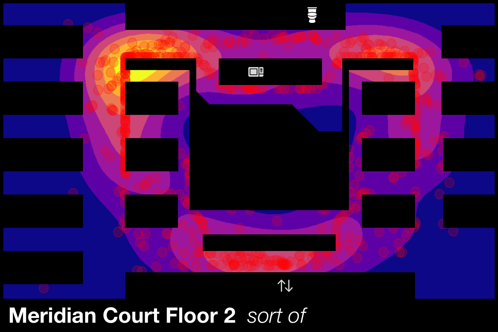
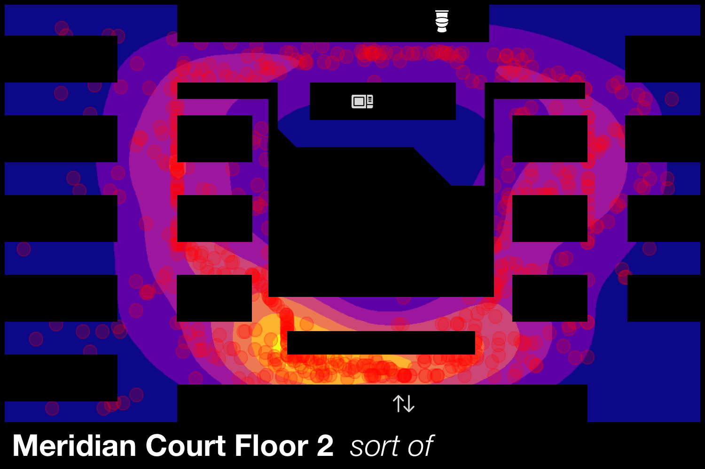

# Agent-Based Infectious Disease Modelling in Julia

## Introduction
This work was developed as part of the Scottish Government [Data Science Accelerator Programme](https://www.gov.scot/publications/data-science-accelerator/).

[Agent-based models](https://en.wikipedia.org/wiki/Agent-based_model) represent a "bottom-up" modelling paradigm, where systems of interest are studied by simulating the behaviours and actions of their lowest level actors (e.g. individual people), letting the system evolve, and recording the results. This type of modelling can naturally include complex emergent phenomena, societal trends, and heterogeneous spatial constraints in a way that is difficult, or impossible, to achieve otherwise.

Despite many readily applicable advantages and use-cases, agent-based modelling is currently somewhat [underused](https://doi.org/10.1186/s12982-021-00102-7) in the public health domain.

This project aimed to develop proof-of-concept agent-based models in [Julia](https://julialang.org/downloads/) (primarily using [Agents.jl](https://juliadynamics.github.io/Agents.jl/stable/)) with direct application to the spread of infectious diseases, but also to gain general expertise in agent-based techniques/libraries and the Julia language, while producing useful reference code/simulations.

## Setup
Instructions for setting up Julia, the general layout of this repository, and running code on your own computer can be found [here](config/README.md).

## Some example notebooks
An interactive Jupyter notebook showing the difference between differential equation disease modelling, and the agent-based equivalent can be found here: 

(alternatively [this](code/01-basic-SIR/01-basic-SIR-jupyter-setup.jl) notebook can be run locally)

A [Pluto](https://github.com/fonsp/Pluto.jl) version of this notebook can be run locally via [this](code/01-basic-SIR/01-basic-SIR-pluto-setup.jl) script -- this is similar in content to the Jupyter notebook, but with more interactive components. Most of the Julia code is also hidden from the user to present a more "blog-like" experience.

## Some example simulations
To demonstrate the sort of specific problem agent-based models are uniquely suited to, a simplified real-life disease transmission scenario was simulated using an office floor plan. Individuals are free to move around the office and walk to e.g. the kitchen, bathroom, exit (or simply stay at their desk), and potentially pass on their infection.

As the agent-based model can capture both *when* and *where* people become infected, it's possible to construct an infection heatmap for this specific space.

This can then be used to inform decision making about the layout of the space, and what effect people's behaviour can have on disease transmission in the area -- e.g. if we cut off access to the kitchen area, we see the infection hot-spot shifts to the exit instead.

Different simulations can be run with e.g. different desk layouts, different numbers of people, one-way walking systems, staggered entry and exit times for staff and so on, to assess their respective impact.

---

